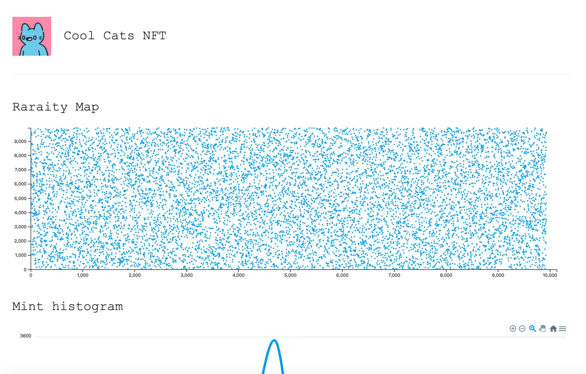
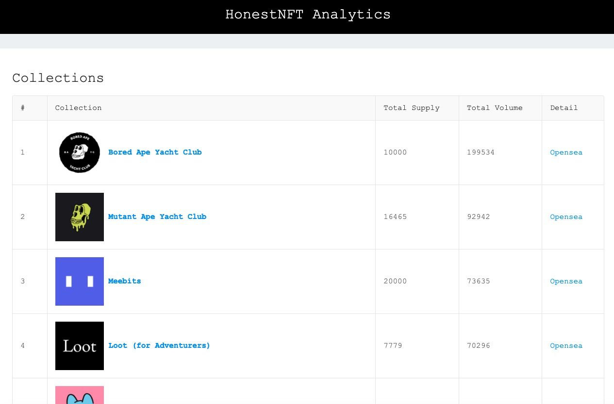

# NFT Analytics




## Install
``` shell
yarn 
```

## Pull Data from Opensea
``` shell
# put the collections information in custom.json;
echo '[{"name": "Doodles", slug: "doodles-official"}]' > custom.json;

# init sqlite database
node init custom

# start fetch 
node fetchAsset.js custom

# generate ks-test
cd analytics
python3 ks_test.py custom

# generate markdon report
node genReport.js custom
```

## Visualization

### Start Server
``` shell
# will running on http://127.0.0.1:8082
node api.js
```
### Visualization
http://127.0.0.1:8082/visualization/


## config.json
``` json
{
    "OPENSEA_API_KEYS": [
        "7c94683799a34c61b89051a5e58ad676"
    ]
}
```